# All Use Cases Lendings 

### VP_N1_LendABookToReader.puml
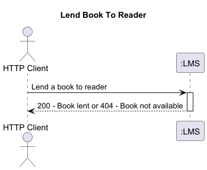

### VP_N2_LendABookToReader.puml
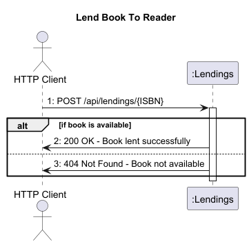

### VP_N1_ListOverdueLending.puml
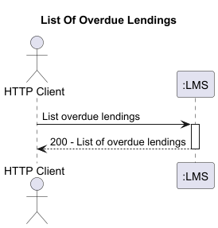

### VP_N2_ListOverdueLending.puml
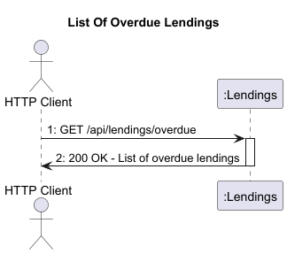

### VP_N1_ReturnABook.puml
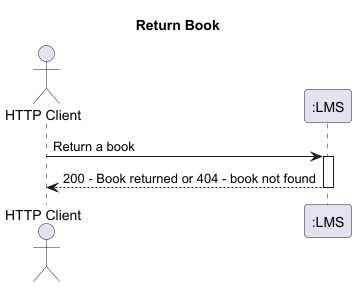

### VP_N2_ReturnABook.puml
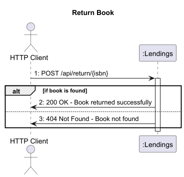

### VP_N1_ViewAverageLendingDuration.puml
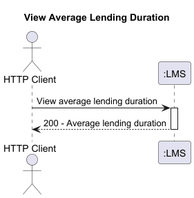

### VP_N2_ViewAverageLendingDuration.puml
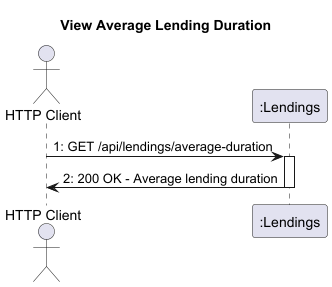

### VP_N1_ViewAverageNumberOfLendingsPerGenreOfCertainMonth.puml
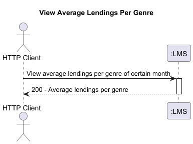

### VP_N2_ViewAverageNumberOfLendingsPerGenreOfCertainMonth.puml
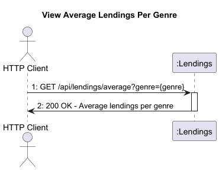

### VP_N1_ViewLendingDetailsGivenLendingNr.puml
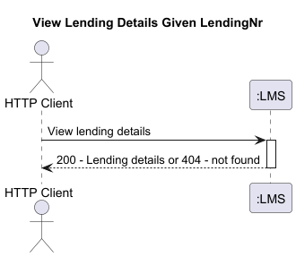

### VP_N2_ViewLendingDetailsGivenLendingNr.puml
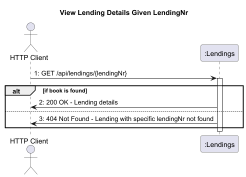